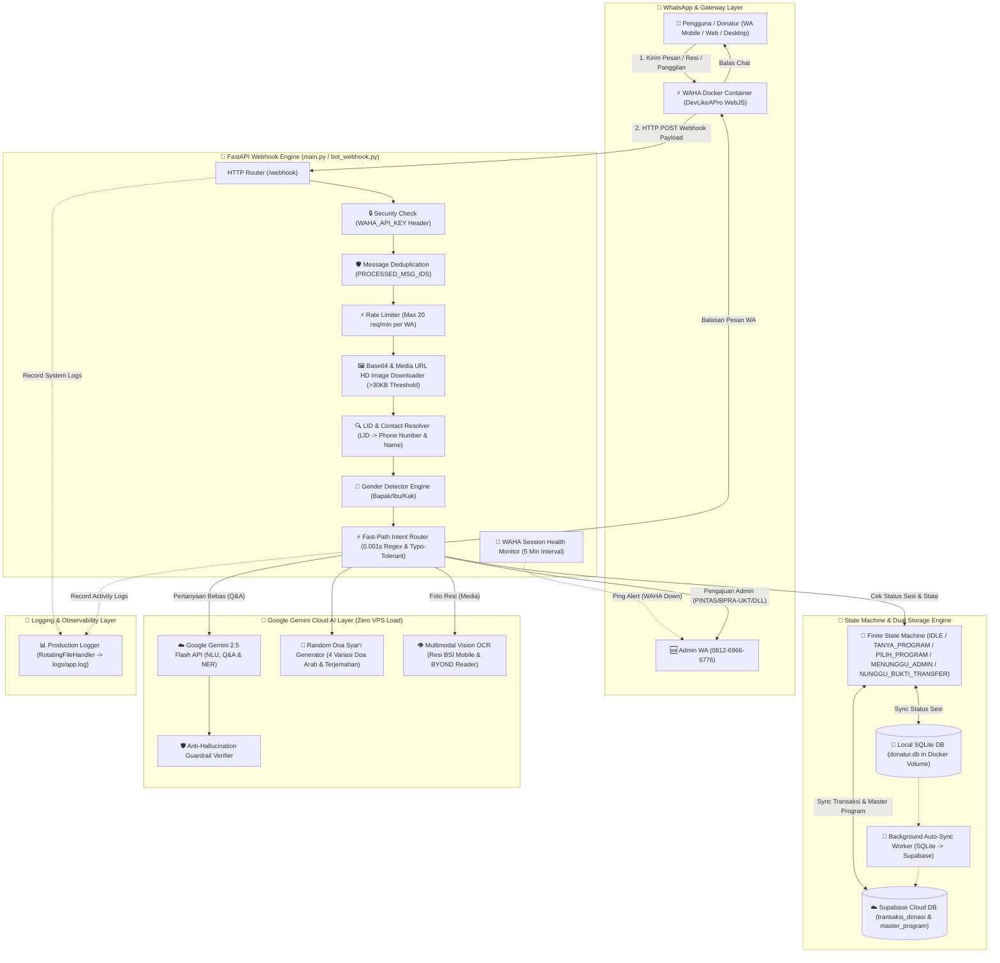
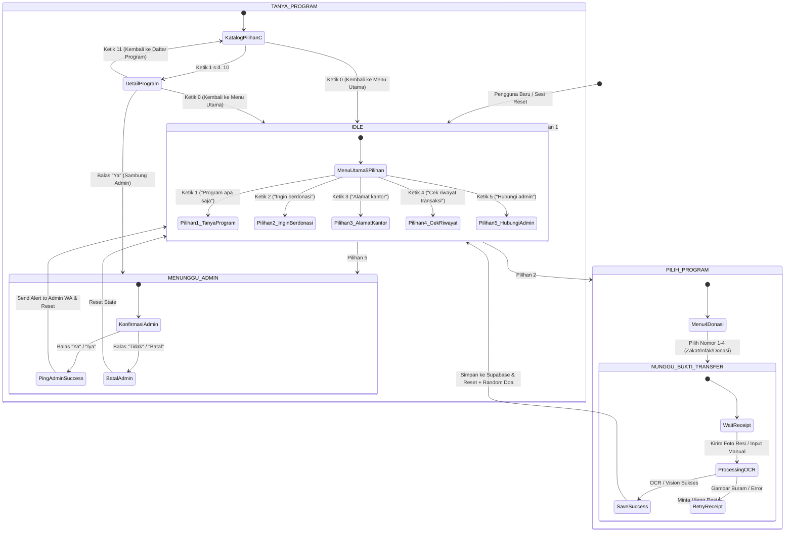
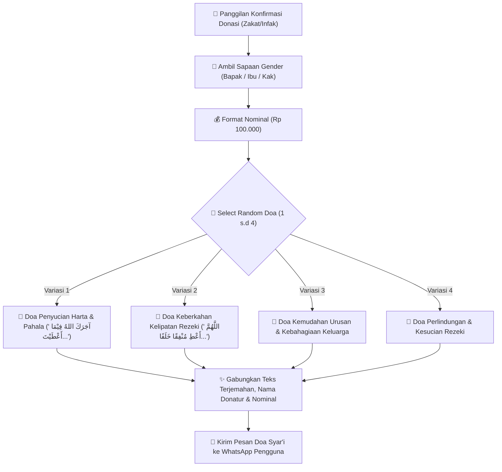
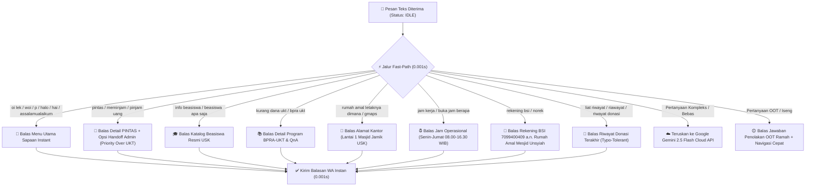

# 🤖 Bot WhatsApp Rumah Amal USK (Hybrid & Cloud AI Engine)

Sistem Bot WhatsApp cerdas, ter-modularisasi, dan berkemampuan hibrida (*Fast-Path Regex + State Machine + Google Gemini 2.5 Flash Cloud AI + AI Vision OCR + Supabase Cloud*) yang dibangun khusus untuk melayani informasi program, penyaluran donasi/zakat, permohonan bantuan (PINTAS/BPRA-UKT), cek riwayat transaksi, deteksi sapaan gender dinamis, generator doa syar'i acak, dan notifikasi *alert* otomatis ke Admin Rumah Amal Masjid Jamik USK.

---

## 🏛️ 1. Arsitektur Sistem Utama

Berikut adalah arsitektur menyeluruh sistem **Bot WhatsApp Rumah Amal USK**, menggambarkan alur komunikasi antar-komponen dari Pengguna, WAHA Engine, FastAPI Controller, State Machine (FSM), Google Gemini Cloud AI, hingga Database Supabase Cloud dan WhatsApp Admin:



---

## 🔄 2. State Machine (FSM 5 Menu Utama & Hirarki Navigasi)

Diagram berikut menjelaskan transisi status (*State Machine*) percakapan pengguna dengan 5 pilihan menu utama serta navigasi dua tingkat (**Level 1: 1-10 & 0, Level 2: 1-N, 11, 0**):



---

## 🤲 3. Random Doa Syar'i Generator Engine (`admin_scripts.py`)

Diagram alur berikut menjelaskan bagaimana sistem menghasilkan **Variasi Doa Syar'i Acak** berbahasa Arab + terjemahan yang berganti-ganti secara alami saat donatur berdonasi:



---

## ⚡ 4. Fast-Path Router Bahasa Santai, Typo-Tolerant & Priority Engine (0.001s)

Diagram alur keputusan Fast-Path instan untuk menangkap sapaan gaul, typo, dan prioritas PINTAS di atas BPRA-UKT:



---

## 🌟 Ringkasan Fitur Unggulan Sistem

1. **Katalog Program Pilihan C (Gabungan):**
   - **1 s.d 5 (Mahasiswa):** `🎓 PINTAS`, `📚 BPRA-UKT`, `👨‍👩‍👧 OTA`, `🌙 Muallaf`, `💼 BPMI`.
   - **6 s.d 10 (Sosial):** `🇵🇸 OTA Palestina`, `🥩 Green Qurban`, `🍱 Nasi Bungkus`, `🚀 ECRA`, `🏦 P2EMD`.

2. **Random Doa Syar'i Generator:**
   - 4 Variasi Doa Syar'i (Lafadz Arab + Terjemahan + Doa Keberkahan) yang berganti-ganti secara acak saat donatur berdonasi.

3. **Background Auto-Sync SQLite $\rightarrow$ Supabase Cloud:**
   - Mengunggah ulang transaksi offline SQLite ke Supabase Cloud saat jaringan pulih.

4. **WAHA Session Health Monitor & Rate Limiter:**
   - Peringatan otomatis ke Admin WA jika WhatsApp bot terputus + Proteksi anti-spam (Max 20 req/min per WA).

5. **HD Media Downloader (>30KB Threshold):**
   - Memaksa WAHA mengunduh foto resi asli beresolusi tinggi (HD > 30KB) dari HP pengirim.

---

## ⚙️ Pengaturan Environment (`.env`)

```env
SUPABASE_URL=https://your-project-id.supabase.co
SUPABASE_KEY=your-supabase-anon-key

WAHA_ENDPOINT=http://waha-gateway:3000
WAHA_API_KEY=amalmaximal123

GEMINI_API_KEY=your-gemini-api-key
MODEL_NAME=gemini-2.5-flash

ADMIN_WA_NUMBER=6281269666776@c.us
```

---

## 🚀 Panduan Deployment Docker

```bash
docker compose up -d --build
```

---

## 🤝 Lisensi & Hak Cipta
Dikembangkan untuk **Rumah Amal Masjid Jamik Universitas Syiah Kuala (USK)**.
