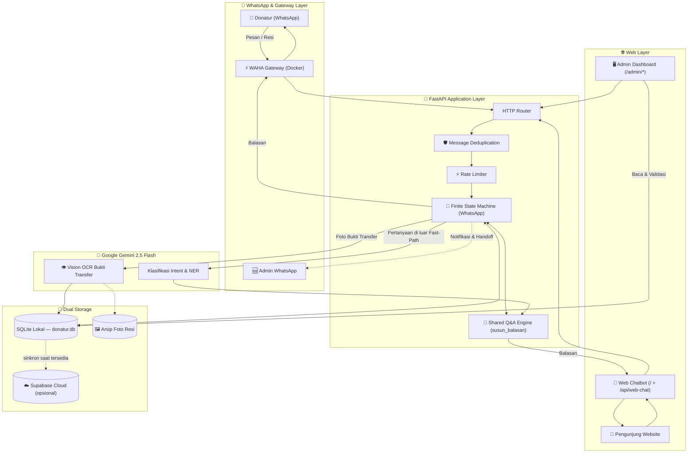

# Sistem Rumah Amal USK

Platform digital donasi & layanan informasi untuk **Rumah Amal Masjid Jamik Universitas Syiah Kuala (USK)** — sebuah Lembaga Amil Zakat (LAZ) kampus. Sistem ini menggantikan proses manual pencatatan donasi, layanan tanya-jawab, dan verifikasi transaksi dengan satu backend terpadu yang melayani tiga kanal sekaligus: **bot WhatsApp**, **web chatbot publik**, dan **dashboard admin internal**.

Dibangun sebagai layanan tunggal berbasis **FastAPI** (Python) dengan **WAHA** (WhatsApp HTTP API) sebagai gateway WhatsApp, **Google Gemini 2.5 Flash** untuk pemahaman bahasa alami & OCR, serta **SQLite + Supabase** sebagai lapisan penyimpanan ganda (lokal + cloud). Seluruh komponen dijalankan sebagai satu unit lewat Docker Compose, di belakang reverse proxy Caddy untuk HTTPS otomatis.

---

## Daftar Isi

- [Ikhtisar](#ikhtisar)
- [Tiga Titik Akses](#tiga-titik-akses)
- [Arsitektur Sistem](#arsitektur-sistem)
- [Fitur Utama](#fitur-utama)
- [Tumpukan Teknologi](#tumpukan-teknologi)
- [Struktur Proyek](#struktur-proyek)
- [Model Data](#model-data)
- [Referensi API](#referensi-api)
- [Menjalankan Secara Lokal](#menjalankan-secara-lokal)
- [Konfigurasi Environment](#konfigurasi-environment)
- [Deployment Produksi](#deployment-produksi)
- [Pertimbangan Keamanan](#pertimbangan-keamanan)
- [Rencana Pengembangan](#rencana-pengembangan)
- [Lisensi](#lisensi--hak-cipta)

---

## Ikhtisar

Rumah Amal USK menerima donasi, zakat, dan infak dari civitas akademika serta masyarakat umum, dan menyalurkannya lewat **13 Program Kebaikan** resmi (sesuai *Buku Saku Program Fundraising Rumah Amal Masjid Jamik USK*): Beasiswa Orang Tua Asuh (OTA), OTA Palestina, PINTAS, Paket Senyum Ramadhan, Bantuan Nasi Bungkus, Dana Solidaritas Umat (Umum & Palestina), Peduli Sigra, Peduli Yatim, Kolaborasi Kebaikan, Rumah Tahfizh, Tabungan Qurban, dan Infaq Bebas. Sebelum sistem ini ada, pertanyaan donatur dan pencatatan transaksi ditangani manual satu per satu.

Sistem ini menghadirkan:

- **Asisten percakapan cerdas** yang menjawab puluhan jenis pertanyaan seputar program, prosedur, dan status donasi — konsisten baik lewat WhatsApp maupun website resmi.
- **Otomasi pencatatan transaksi** dari foto bukti transfer memakai *vision AI*, lengkap dengan alur validasi berlapis sebelum data dianggap sah.
- **Panel kendali internal** bagi staf untuk memantau arus donasi secara real-time, memvalidasi transaksi yang masuk lewat website, dan meninjau seluruh riwayat percakapan bot.

---

## Tiga Titik Akses

| Kanal | Rute | Audiens | Autentikasi |
|---|---|---|---|
| **Bot WhatsApp** | Webhook `/webhook` (dipanggil WAHA) | Donatur via WhatsApp | Identitas terverifikasi otomatis lewat sesi nomor WA |
| **Pilih Channel** | `/pilih-channel` | Pengunjung dari widget di beranda rumahamal.usk.ac.id | - (halaman pilihan: lanjut ke WhatsApp atau Web Chat) |
| **Web Chatbot** | `/`, `/api/web-chat`, `/api/web-otp/*`, `/api/web-chat/upload-resi` | Pengunjung situs resmi | Anonim untuk tanya-jawab umum; verifikasi OTP WhatsApp untuk data transaksi |
| **Admin Dashboard** | `/admin/*` | Staf internal | Login sesi (username/password) |
| **Health Check** | `/health` | Pemantauan infrastruktur | - |

Kedua kanal donatur (WhatsApp & Web) berbagi **satu mesin jawaban yang sama** (`susun_balasan`), sehingga fakta yang disampaikan selalu konsisten di kedua tempat — namun perilakunya sengaja dibedakan sesuai konteks keamanannya: WhatsApp mempercayai identitas yang sudah terverifikasi lewat nomor HP aktif, sedangkan Web mewajibkan verifikasi OTP sebelum mengizinkan akses ke data transaksi, dan menahan unggahan bukti transfer dalam status "menunggu validasi" sampai staf meninjaunya secara manual.

---

## Arsitektur Sistem



---

## Fitur Utama

### 🤖 Bot WhatsApp
- **Fast-Path Router** — lebih dari 20 pola pertanyaan umum (sapaan, alamat, jam operasional, rekening, katalog program) dijawab instan lewat pencocokan pola tanpa memanggil API eksternal sama sekali, toleran terhadap typo dan bahasa santai/gaul.
- **Finite State Machine** percakapan multi-langkah untuk alur donasi (pemilihan program → instruksi transfer → unggah bukti → konfirmasi), permohonan bantuan (PINTAS), dan sesi konsultasi program.
- **Klasifikasi niat berbasis AI** sebagai lapisan kedua untuk pertanyaan bebas yang tidak tertangkap Fast-Path, dipetakan ke lebih dari 45 kategori jawaban resmi.
- **Vision OCR bukti transfer** — foto resi BSI Mobile/BYOND dibaca langsung oleh model multimodal untuk mengekstrak nama pengirim dan nominal, dengan jalur cadangan permintaan input manual bila hasil bacaan meragukan.
- **Generator doa syar'i acak** — 4 variasi ucapan terima kasih berbahasa Arab dan terjemahan yang bergantian otomatis setiap donasi tercatat.
- **Deteksi sapaan gender dinamis** dari nama pengirim untuk personalisasi sapaan (Bapak/Ibu/Kak).
- **Rate limiting** per nomor WhatsApp dan **deduplikasi pesan** untuk menahan replay webhook.
- **Monitor kesehatan sesi WAHA** dengan notifikasi otomatis ke admin bila koneksi WhatsApp terputus.

### 🧠 Pemahaman Bahasa Donatur
Donatur mayoritas orang dewasa yang menulis apa adanya, jadi mesin jawaban sengaja toleran:
- **Beda ejaan & salah ketik ringan**: *tahfiz/tahfidz/tahfizh*, *kurban/qurban*, *infak/infaq*, *kolaborsi kebaikan*, *tabungn qurban* tetap dikenali. Kata pendek tetap wajib cocok persis, supaya *korban* (bencana) tidak tertukar dengan *kurban*.
- **Bahasa sehari-hari**: *apa aja*, *pinjem duit*, *pengen donasi*, *makasih min*, *donasi*/*sedekah* satu kata.
- **Balasan angka**: di web, mengetik `1`/`3`/`11` dipahami sesuai daftar bernomor terakhir yang ditampilkan bot (menu sapaan, kategori donasi, atau katalog 13 program).
- **Alur hubungi admin tanpa jalan buntu**: tawaran admin setelah info PINTAS bersifat opsional (tidak mengunci percakapan); saat dimintai nomor WA, pengguna tetap bisa membatalkan atau beralih bertanya hal lain.
- **Identitas pencipta**: pertanyaan "siapa yang membuat kamu?" dan sejenisnya dijawab dengan perkenalan pencipta Mimin.

### 💬 Web Chatbot Publik
- Antarmuka chat responsif dengan pintasan cepat (katalog program, konsultasi zakat, cara berdonasi) dan area unggah bukti transfer. Di HP, menu samping otomatis menutup setelah pintasan ditekan supaya balasan langsung terlihat.
- **Mode siang/malam** dengan pilihan tersimpan di perangkat, latar kontur topografi WebGL, dan tampilan transparan di HP.
- **Ramah aksesibilitas**: pinch-zoom tetap diizinkan tanpa merusak tata letak (untuk pengguna yang perlu memperbesar tulisan), dan kolom isian berukuran 16px di HP agar browser tidak zoom otomatis saat keyboard terbuka.
- Memakai mesin jawaban yang identik dengan bot WhatsApp — jawaban tetap konsisten lintas kanal, dengan penyesuaian navigasi khusus web (tanpa instruksi "ketik angka" yang hanya relevan di WhatsApp).
- **Verifikasi OTP** lewat WhatsApp sebelum mengizinkan akses ke riwayat transaksi pribadi — mencegah data donasi diintip pihak yang tidak berhak.
- Bukti transfer yang diunggah lewat web disimpan berstatus **menunggu validasi** hingga ditinjau staf, karena identitas pengunjung belum terverifikasi sepenuhnya saat unggah.
- Halaman **Pilih Channel** (`/pilih-channel`) untuk pengunjung dari widget beranda: lanjut ke WhatsApp resmi atau Web Chat, dengan tombol kembali ke rumahamal.usk.ac.id.

### 🖥️ Admin Dashboard
- **Overview real-time**: total donasi/zakat/infak, jumlah donatur aktif, dan tren arus donasi 7 hari terakhir dalam grafik interaktif.
- **Manajemen transaksi**: pencarian, filter kategori/status, dan alur persetujuan (**Tervalidasi / Menunggu / Ditolak**) khusus untuk bukti transfer yang masuk lewat web.
- **Koreksi penuh**: kategori dan status tetap bisa diubah walau transaksi sudah divalidasi, dan transaksi bisa **dihapus permanen** (dengan konfirmasi dua langkah) bila ternyata keliru.
- Penanda **"ID WA"** pada transaksi yang nomornya berupa ID internal WhatsApp (`@lid`) yang gagal diterjemahkan jadi nomor telepon asli, supaya staf tidak mengira itu salah baca.
- **Peninjau bukti transfer** — foto resi asli yang diunggah donatur dapat dilihat langsung oleh staf sebelum memutuskan validasi.
- **Log Bot** — transkrip lengkap percakapan Mimin AI dari kedua kanal (WhatsApp & Web), dikelompokkan per kontak/sesi, untuk audit kualitas jawaban dan penelusuran keluhan.
- Sesi login terautentikasi dengan proteksi cookie `HttpOnly`.

### 🔐 Keamanan & Keandalan
- Validasi ukuran (maks. 5MB) dan tipe berkas (pencocokan *magic bytes*) untuk setiap unggahan gambar publik.
- Rate limiting pada endpoint chat, permintaan OTP (dengan jeda per-nomor tujuan, bukan hanya per-IP), dan unggahan resi.
- Penyimpanan gambar resi dilayani lewat endpoint terproteksi login dengan validasi nama berkas ketat, mencegah *path traversal*.
- Skema database bermigrasi otomatis saat startup — penambahan kolom baru tidak memerlukan migrasi manual di server produksi.
- Penyimpanan ganda (SQLite lokal + Supabase cloud) dengan *graceful fallback*: kegagalan koneksi cloud tidak pernah menggagalkan pencatatan transaksi.
- Validasi nomor WhatsApp di satu titik penyimpanan transaksi (`simpan_transaksi_final`): nilai yang tidak menyerupai nomor telepon (mis. teks "status") ditolak, bukan ikut tersimpan.

---

## Tumpukan Teknologi

| Lapisan | Teknologi |
|---|---|
| Backend | Python 3.10, FastAPI, Uvicorn |
| Templating & Frontend | Jinja2 (server-rendered), Tailwind CSS, vanilla JavaScript |
| Gateway WhatsApp | WAHA (WebJS engine, self-hosted via Docker) |
| Kecerdasan Buatan | Google Gemini 2.5 Flash (klasifikasi intent, NER, Vision OCR) |
| Basis Data | SQLite (penyimpanan utama lokal), Supabase/PostgreSQL (cloud, opsional) |
| Reverse Proxy & TLS | Caddy 2 (HTTPS otomatis) |
| Orkestrasi | Docker Compose |

---

## Struktur Proyek

```
bot-rumah-amal/
├── app/
│   ├── main.py                    # Entry point FastAPI, registrasi router
│   ├── admin_scripts.py           # Mesin Q&A bersama (susun_balasan, QA_SCRIPT, klasifikasi intent)
│   ├── routes/
│   │   ├── bot_webhook.py         # Webhook WhatsApp: FSM, fast-path, integrasi WAHA
│   │   ├── public_web.py          # API web chatbot publik: chat, OTP, unggah resi
│   │   └── admin_web.py           # Dashboard admin: auth, data transaksi, log percakapan
│   ├── services/
│   │   ├── state_manager.py       # Lapisan data (SQLite + orkestrasi Supabase)
│   │   ├── supabase_client.py     # Klien Supabase Cloud
│   │   ├── llm_agent.py           # Integrasi Google Gemini (intent, NER, Vision OCR)
│   │   ├── program_manager.py     # 13 program resmi, urutan katalog, toleransi ejaan/salah ketik
│   │   ├── gender_detector.py     # Deteksi sapaan gender dari nama
│   │   ├── form_parser.py         # Parser formulir infak rutin
│   │   └── logger.py              # Logger produksi dengan rotasi file
│   ├── templates/
│   │   ├── public/chat.html       # UI web chatbot
│   │   ├── public/pilih_channel.html  # Halaman pilih WhatsApp / Web Chat
│   │   └── admin/                 # UI dashboard (login, overview, transaksi, log bot)
│   ├── static/public/             # chat.js, ikon bot (favicon), logo Rumah Amal
│   └── tests/                     # Test otomatis (pytest)
├── docker-compose.yml             # Orkestrasi 3 kontainer: api-bot, waha-gateway, caddy
├── Dockerfile                     # Image aplikasi FastAPI
└── requirements.txt
```

---

## Model Data

Tabel utama pada `donatur.db` (SQLite), tersinkron opsional ke Supabase:

| Tabel | Fungsi |
|---|---|
| `transaksi_donasi` | Catatan setiap donasi: nominal, program, waktu, sumber (WhatsApp/Web), status verifikasi, referensi foto resi |
| `sesi_percakapan` | Status FSM aktif per nomor WhatsApp |
| `master_program` | Katalog kode & kategori program |
| `log_percakapan` | Transkrip pesan masuk/keluar per kontak, untuk fitur Log Bot |

Transaksi dari WhatsApp otomatis berstatus **tervalidasi** (identitas sudah pasti dari sesi nomor aktif), sementara transaksi dari Web Chat berstatus **menunggu** sampai staf memvalidasinya secara manual di dashboard — perbedaan perlakuan ini disengaja sebagai lapisan keamanan tambahan untuk kanal yang identitasnya belum sepenuhnya terverifikasi saat unggah.

---

## Referensi API

| Method | Endpoint | Deskripsi |
|---|---|---|
| `POST` | `/webhook` | Menerima event pesan dari WAHA |
| `GET` | `/` | Halaman web chatbot |
| `GET` | `/pilih-channel` | Halaman pilihan kanal (WhatsApp / Web Chat) |
| `POST` | `/api/web-chat` | Kirim pesan ke mesin jawaban, menerima balasan JSON |
| `POST` | `/api/web-otp/request` | Meminta kode OTP verifikasi via WhatsApp |
| `POST` | `/api/web-otp/verify` | Memverifikasi kode OTP, membuka akses riwayat transaksi |
| `POST` | `/api/web-chat/upload-resi` | Mengunggah foto bukti transfer untuk diproses AI |
| `GET` | `/admin/login` · `POST` `/admin/login` | Autentikasi staf |
| `GET` | `/admin/dashboard` | Overview KPI & tren donasi |
| `GET` | `/admin/transactions` | Manajemen & validasi transaksi |
| `POST` | `/admin/transactions/{id}/status` | Mengubah status validasi dan/atau kategori transaksi |
| `POST` | `/admin/transactions/{id}/delete` | Menghapus transaksi permanen (SQLite + foto resi) |
| `GET` | `/admin/log-bot` | Transkrip percakapan bot |
| `GET` | `/admin/resi/{filename}` | Menyajikan foto resi (terproteksi sesi login) |
| `GET` | `/health` | Status kesehatan layanan |

---

## Menjalankan Secara Lokal

Prasyarat: Docker & Docker Compose.

```bash
git clone <url-repository>
cd bot-rumah-amal
cp .env.example .env               # isi kredensial Anda, lihat bagian Konfigurasi Environment
cp Caddyfile.example Caddyfile     # ganti domain contoh dengan domain Anda sendiri
docker compose up -d --build
```

Layanan akan berjalan di `http://localhost:8000` (aplikasi) dan `http://localhost:3000` (WAHA — perlu dipindai QR code WhatsApp sekali lewat panel WAHA agar bot WhatsApp aktif).

### Menjalankan Test

```bash
GEMINI_API_KEY= python -m pytest app/tests/ -q
```

Test memakai database SQLite sementara (tidak pernah menyentuh `donatur.db` atau data produksi) dan mencakup alur WhatsApp, web chat, OTP, unggah resi, serta dashboard admin. `GEMINI_API_KEY=` dikosongkan dengan sengaja: seluruh test harus lulus tanpa Gemini, jadi hasilnya pasti, tidak bergantung jaringan, dan tidak memakan kuota. Termasuk test yang membaca **setiap tombol pintasan** di `chat.html` dan memastikan tidak ada yang dijawab "kurang paham".

---

## Konfigurasi Environment

```env
# Google Gemini (klasifikasi intent, NER, Vision OCR)
GEMINI_API_KEY=your-gemini-api-key
MODEL_NAME=gemini-2.5-flash

# WAHA WhatsApp Gateway
WAHA_ENDPOINT=http://waha-gateway:3000
WAHA_API_KEY=ganti-dengan-string-acak-yang-kuat

# Nomor WhatsApp admin (penerima notifikasi & handoff)
ADMIN_WA_NUMBER=62xxxxxxxxxxx@c.us

# Supabase Cloud (opsional — sistem tetap berjalan penuh dengan SQLite saja jika kosong)
SUPABASE_URL=https://your-project-id.supabase.co
SUPABASE_KEY=your-supabase-anon-key

# Login Admin Dashboard
ADMIN_DASHBOARD_USERNAME=admin
ADMIN_DASHBOARD_PASSWORD=ganti-dengan-password-kuat
```

---

## Deployment Produksi

Arsitektur produksi menjalankan tiga kontainer dalam satu jaringan Docker internal:

1. **`api-bot`** — aplikasi FastAPI utama.
2. **`waha-gateway`** — sesi WhatsApp Web, hanya perlu dapat diakses dari dalam jaringan internal.
3. **`caddy`** — reverse proxy yang menerbitkan sertifikat TLS otomatis dan meneruskan trafik HTTPS publik ke `api-bot`.

Volume Docker (`sqlite_data`) memastikan basis data dan arsip foto resi tetap persisten lintas pembaruan/rebuild kontainer.

```bash
docker compose up -d --build
```

---

## Pertimbangan Keamanan

- **Verifikasi berjenjang berbasis kanal**: WhatsApp mempercayai sesi nomor aktif; Web mewajibkan OTP untuk data sensitif dan menahan unggahan publik dalam status tinjauan manual.
- **Validasi berkas ketat** pada semua unggahan gambar publik (ukuran & *magic bytes*), mencegah berkas berbahaya menyamar sebagai gambar.
- **Rate limiting** berlapis (per-IP dan per-nomor tujuan) pada seluruh endpoint publik yang bisa memicu pengiriman pesan WhatsApp, mencegah penyalahgunaan sebagai alat spam.
- **Isolasi akses berkas** — foto bukti transfer hanya dapat diakses lewat sesi admin terautentikasi, bukan tautan statis publik.
- **Kredensial dikelola lewat environment variable**, tidak pernah disimpan dalam kode sumber.

---

## Rencana Pengembangan

- Sinkronisasi dua arah SQLite ↔ Supabase dengan penanda status sinkron, untuk pemulihan otomatis pasca gangguan koneksi cloud (termasuk ikut menghapus di Supabase saat staf menghapus transaksi di dashboard — saat ini hanya terhapus di SQLite).
- Migrasi gateway dari WAHA (otomasi WhatsApp Web, tidak resmi) ke **WhatsApp Business Cloud API** resmi untuk nomor lembaga, supaya nomor tidak berisiko diblokir.
- Retensi & kontrol akses berjenjang untuk data transkrip percakapan (Log Bot).
- Cadangan otomatis untuk arsip foto bukti transfer ke penyimpanan objek cloud.
- Dukungan multi-worker dengan session store terpusat (Redis) untuk skala trafik yang lebih besar.

---

## Lisensi & Hak Cipta

Dikembangkan oleh **Yafi Hidayatullah** (Informatika, Universitas Syiah Kuala) untuk **Rumah Amal Masjid Jamik Universitas Syiah Kuala (USK)**.
