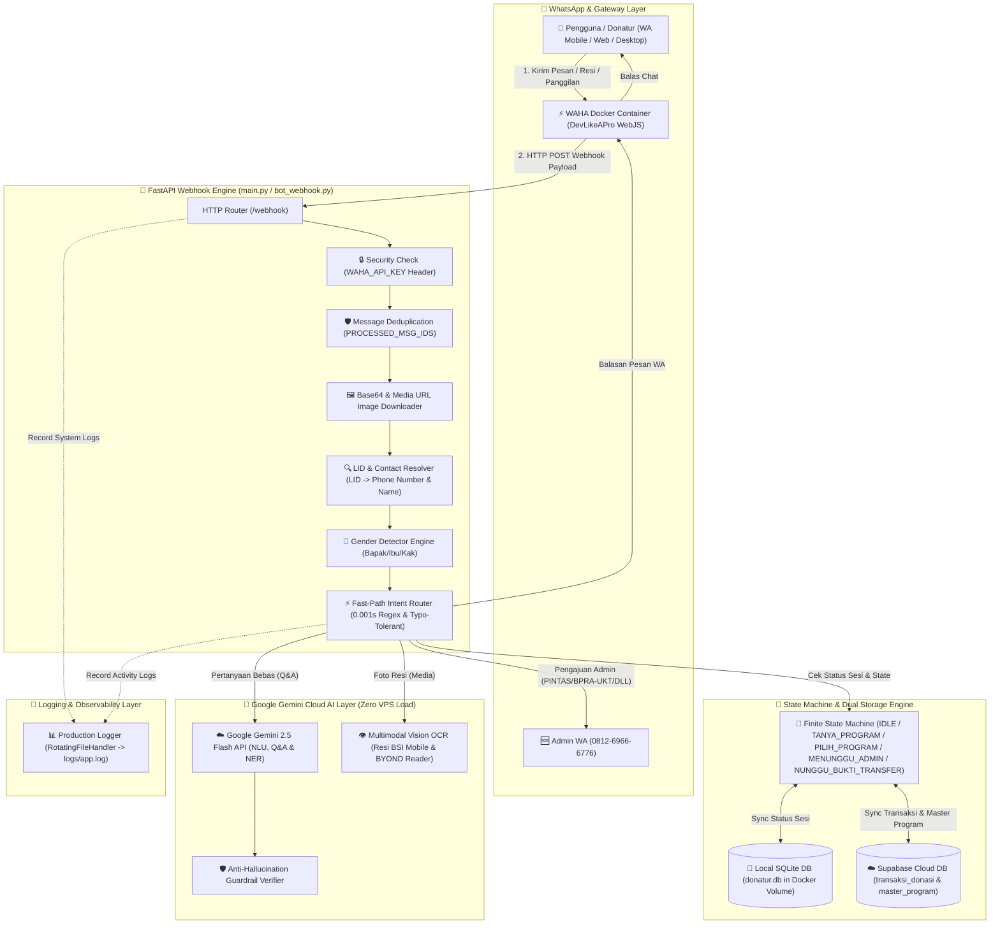
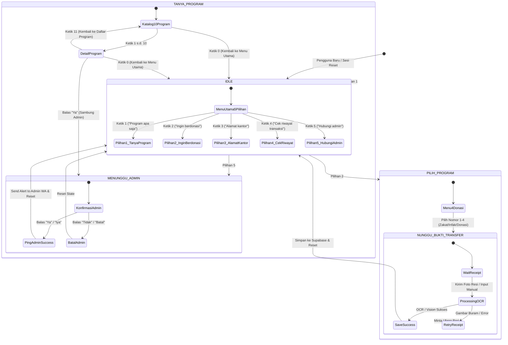
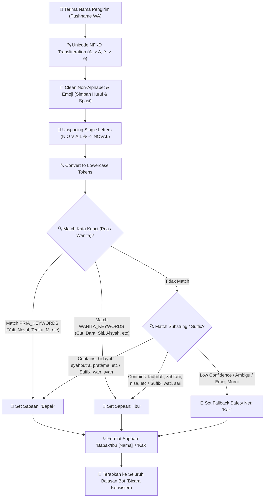
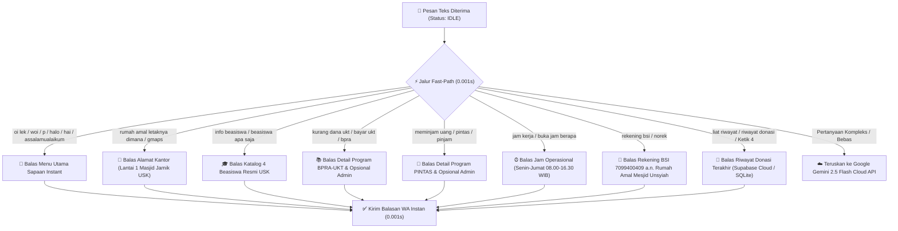
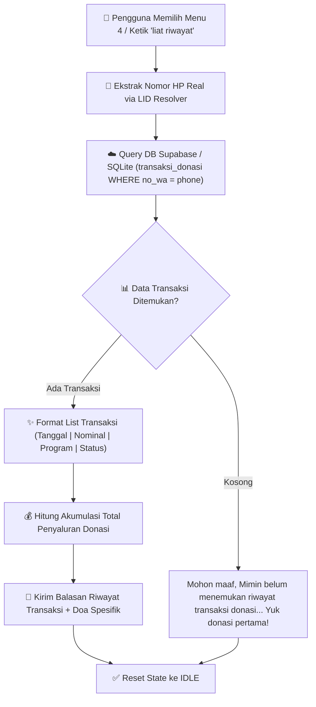
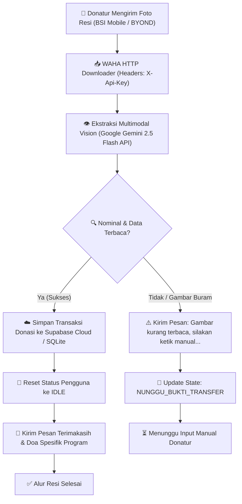
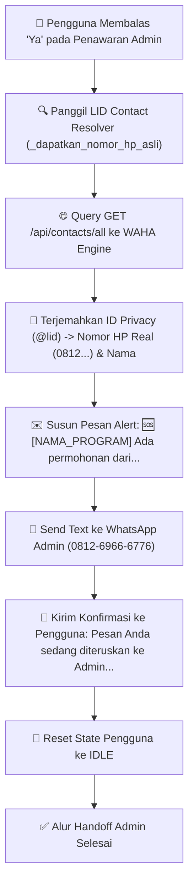

# 🤖 Bot WhatsApp Rumah Amal USK (Hybrid & Cloud AI Engine)

Sistem Bot WhatsApp cerdas, ter-modularisasi, dan berkemampuan hibrida (*Fast-Path Regex + State Machine + Google Gemini 2.5 Flash Cloud AI + AI Vision OCR + Supabase Cloud*) yang dibangun khusus untuk melayani informasi program, penyaluran donasi/zakat, permohonan bantuan (PINTAS/BPRA-UKT), cek riwayat transaksi, deteksi sapaan gender dinamis, dan notifikasi *alert* otomatis ke Admin Rumah Amal Masjid Jamik USK.

---

## 🏛️ 1. Arsitektur Sistem Utama

Berikut adalah arsitektur menyeluruh sistem **Bot WhatsApp Rumah Amal USK**, menggambarkan alur komunikasi antar-komponen dari Pengguna, WAHA Engine, FastAPI Controller, State Machine (FSM), Google Gemini Cloud AI, hingga Database Supabase Cloud dan WhatsApp Admin:



---

## 🔄 2. State Machine (FSM 5 Menu Utama & Hirarki Navigasi)

Diagram berikut menjelaskan transisi status (*State Machine*) percakapan pengguna dengan 5 pilihan menu utama serta navigasi dua tingkat (**Level 1: 1-10 & 0, Level 2: 1-N, 11, 0**):



---

## 👤 3. Engine Deteksi Gender & Normalisasi Sapaan (`gender_detector.py`)

Diagram alur berikut menjelaskan bagaimana sistem membersihkan nama profil WhatsApp (`pushname`) donatur dan menentukan sapaan **Bapak**, **Ibu**, atau **Kak** secara presisi:



---

## ⚡ 4. Fast-Path Router Bahasa Santai / Nyeleneh / Sapaan Gaul (0.001 Detik)

Diagram alur keputusan Fast-Path instan untuk menangkap pertanyaan santai/nyeleneh & sapaan gaul tanpa tergantung pada server LLM:



---

## 📜 5. Alur Cek Riwayat Transaksi Donasi Berbasis Nomor WA

Diagram alur berikut menjelaskan bagaimana fitur Cek Riwayat Transaksi bekerja secara aman berbasis nomor WhatsApp pengirim:



---

## 📸 6. Alur Pemrosesan Resi & Multimodal Vision OCR (`Gemini 2.5 Flash`)

Diagram urutan berikut menjelaskan alur pemrosesan foto resi transfer BSI Mobile / BYOND dari donatur hingga pencatatan ke database:



---

## 🆘 7. Notifikasi Alert Admin & LID Resolver

Diagram urutan berikut menjelaskan alur penerjemahan ID WhatsApp Privacy (`@lid`) dan pengiriman pesan *ping* peringatan otomatis ke WhatsApp Admin (`0812-6966-6776`):



---

## 🌟 Ringkasan Fitur Unggulan Sistem

1. **Menu Utama 5 Pilihan Bebas Tabrakan:**
   - `1. Program apa saja?` (Katalog 10 Program)
   - `2. Ingin berdonasi?` (Menu Zakat & Donasi)
   - `3. Alamat kantor?` (Lokasi Masjid Jamik USK)
   - `4. Cek riwayat transaksi` (Histori Donasi Terverifikasi)
   - `5. Hubungi admin` (Sambungkan ke Admin WA)

2. **Dua Tingkat Navigasi Program (Level 1 & Level 2):**
   - **Level 1 (Daftar Program):** Ketik `1 s.d. 10` (Pilih Program), Ketik `0` (Kembali ke Menu Utama).
   - **Level 2 (Detail Program & QNA):** Ketik `1 s.d. N` (Baca QNA), Ketik `11` (Kembali ke Daftar Program), Ketik `0` (Kembali ke Menu Utama).

3. **Gender Detector & Salutation Engine (`services/gender_detector.py`):**
   - Deteksi gender otomatis dari nama/pushname (Unicode NFKD Transliteration + Unspacing Single-Letter).
   - Menyapa **Bapak** / **Ibu** secara konsisten di seluruh layar percakapan.

4. **Fast-Path Router Bahasa Santai & Typo-Tolerant (0.001 Detik):**
   - Respon instan kilat untuk sapaan gaul (*"oi lek"*, *"woi"*), alamat (*"letaknya dimana"*), info beasiswa (*"info beasiswa"*), bantuan UKT (*"kurang dana ukt"*), pinjaman (*"meminjam uang"*), jam kerja (*"buka jam berapa"*), nomor rekening (*"norek bsi"*), dan riwayat (*"liat riwayat"*).

5. **Google Gemini 2.5 Flash Cloud AI (Zero VPS Load):**
   - Menggunakan model cloud `gemini-2.5-flash` untuk NLU, Q&A, dan Vision OCR resi transfer. Latensi super cepat (~0.3s) dan beban VPS 0%.

6. **Dual Database Sync (Supabase Cloud + Local SQLite Volume):**
   - Sinkronisasi real-time ke Supabase Cloud dengan proteksi offline fallback otomatis ke SQLite lokal (`sqlite_data` volume).

---

## ⚙️ Pengaturan Environment (`.env`)

Buat atau perbarui berkas `.env` di direktori utama proyek dengan variabel berikut:

```env
# Credentials Supabase Cloud (Opsional - Fallback ke SQLite)
SUPABASE_URL=https://your-project-id.supabase.co
SUPABASE_KEY=your-supabase-anon-key

# WAHA WhatsApp Gateway Configuration
WAHA_ENDPOINT=http://waha-gateway:3000
WAHA_API_KEY=amalmaximal123

# Google Gemini Cloud AI API Key
GEMINI_API_KEY=your-gemini-api-key-from-google-ai-studio
MODEL_NAME=gemini-2.5-flash

# Nomor WhatsApp Admin Penerima Notifikasi Alert
ADMIN_WA_NUMBER=6281269666776@c.us
```

---

## 🚀 Panduan Jalankan & Local Docker Deployment

### Jalankan Komplit via Docker Compose (Rekomendasi Utama)
```bash
docker compose up -d --build
```

- **Dashboard WAHA:** `http://localhost:3000` (Scan QR Code)
- **FastAPI Bot Webhook:** `http://localhost:8000/webhook`

---

## 🧪 Pengujian Otomatis (Test Suite)

Skrip pengujian otomatis komprehensif untuk memverifikasi seluruh alur tanpa error:

```bash
python test_hybrid.py
```

---

## 📂 Struktur Folder Proyek

```text
bot-rumah-amal/
├── Dockerfile               # Konfigurasi container Docker FastAPI
├── docker-compose.yml       # Production stack (api-bot + waha-gateway + volumes)
├── .env                     # File konfigurasi rahasia (API Key & Supabase)
├── .env.example             # Template file environment
├── README.md                # Dokumentasi arsitektur & panduan sistem lengkap
└── app/
    ├── main.py              # Entry point FastAPI & route listener
    ├── admin_scripts.py     # Skrip fakta resmi & matcher intent
    ├── routes/
    │   └── bot_webhook.py   # Handler webhook WAHA, FSM, & router utama
    └── services/
        ├── gender_detector.py # Engine deteksi gender (Bapak/Ibu/Kak)
        ├── logger.py          # Production logger (RotatingFileHandler)
        ├── program_manager.py # Pengelola 10 data resmi program Rumah Amal
        ├── state_manager.py   # Pengelola FSM State (SQLite + Supabase sync)
        ├── supabase_client.py # Client Supabase & PostgREST fallback
        ├── form_parser.py     # Parser regex formulir donasi
        └── llm_agent.py       # Client Google Gemini 2.5 Flash API & Vision OCR
```

---

## 🤝 Lisensi & Hak Cipta
Dikembangkan untuk **Rumah Amal Masjid Jamik Universitas Syiah Kuala (USK)**.
