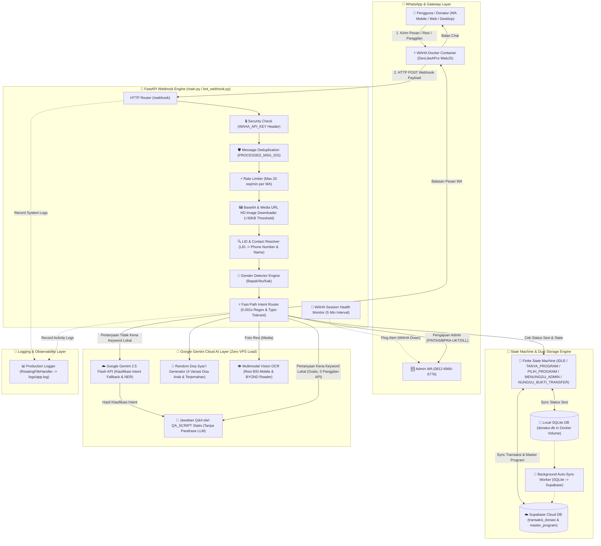
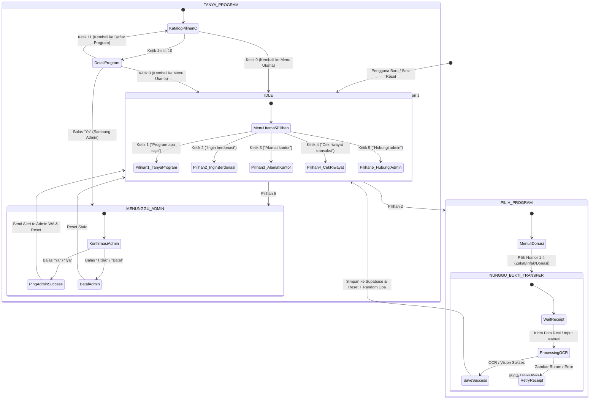
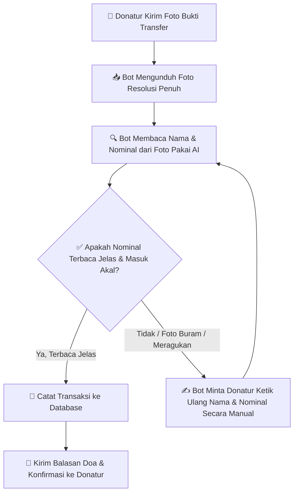
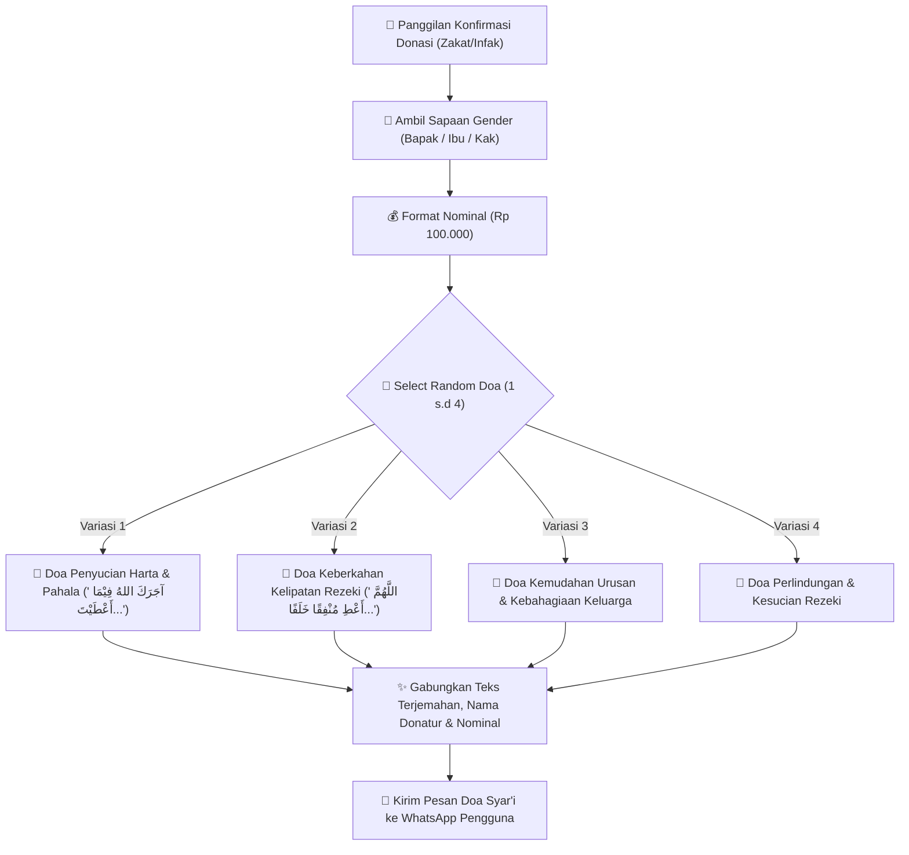
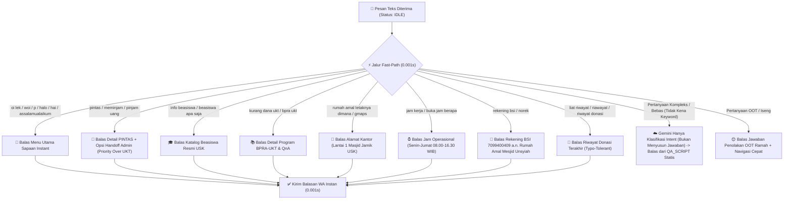
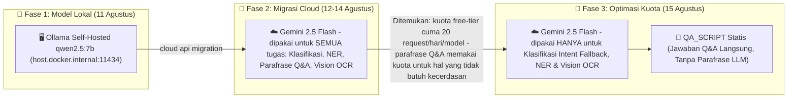

# 🤖 Sistem Rumah Amal USK (Bot WhatsApp + Admin Dashboard + Web Chatbot)

Sistem donasi digital Rumah Amal Masjid Jamik USK dengan 3 titik akses: **Bot WhatsApp** (hibrida Fast-Path Regex + State Machine + Google Gemini 2.5 Flash Cloud AI + Vision OCR + Supabase Cloud), **Admin Dashboard** (`/admin`, panel kendali internal staf), dan **Web Chatbot Publik** (`/`, widget chat untuk website). Melayani informasi program, penyaluran donasi/zakat, permohonan bantuan (PINTAS/BPRA-UKT), cek riwayat transaksi (dengan verifikasi OTP di kanal web), deteksi sapaan gender dinamis, generator doa syar'i acak, dan notifikasi *alert* otomatis ke Admin.

---

## 🏛️ 1. Arsitektur Sistem Utama

Berikut adalah arsitektur menyeluruh sistem **Bot WhatsApp Rumah Amal USK**, menggambarkan alur komunikasi antar-komponen dari Pengguna, WAHA Engine, FastAPI Controller, State Machine (FSM), Google Gemini Cloud AI, hingga Database Supabase Cloud dan WhatsApp Admin:



---

## 🔄 2. State Machine (FSM 5 Menu Utama & Hirarki Navigasi)

Diagram berikut menjelaskan transisi status (*State Machine*) percakapan pengguna dengan 5 pilihan menu utama serta navigasi dua tingkat (**Level 1: 1-10 & 0, Level 2: 1-N, 11, 0**):



---

## 💸 3. Alur Konfirmasi Pembayaran (Foto Resi -> Baca Otomatis -> Simpan)

Diagram berikut menjelaskan apa yang terjadi saat donatur mengirim foto bukti transfer, dari foto diterima sampai tercatat di sistem - termasuk pengaman yang memastikan data yang tersimpan benar-benar valid, tidak asal simpan meski hasil bacaan AI kurang jelas:



---

## 🤲 4. Random Doa Syar'i Generator Engine (`admin_scripts.py`)

Diagram alur berikut menjelaskan bagaimana sistem menghasilkan **Variasi Doa Syar'i Acak** berbahasa Arab + terjemahan yang berganti-ganti secara alami saat donatur berdonasi:



---

## ⚡ 5. Fast-Path Router Bahasa Santai, Typo-Tolerant & Priority Engine (0.001s)

Diagram alur keputusan Fast-Path instan untuk menangkap sapaan gaul, typo, dan prioritas PINTAS di atas BPRA-UKT:



---

## 🧭 6. Evolusi Arsitektur AI (Ollama Lokal -> Cloud -> Optimasi Kuota)

Pemilihan mesin AI pada proyek ini melewati 3 fase, masing-masing dipicu oleh temuan nyata di lapangan - bukan keputusan sekali jalan yang tidak pernah dievaluasi ulang:



---

## 🌟 Ringkasan Fitur Unggulan Sistem

1. **Katalog Program Pilihan C (Gabungan):**
   - **1 s.d 5 (Mahasiswa):** `🎓 PINTAS`, `📚 BPRA-UKT`, `👨‍👩‍👧 OTA`, `🌙 Muallaf`, `💼 BPMI`.
   - **6 s.d 10 (Sosial):** `🇵🇸 OTA Palestina`, `🥩 Green Qurban`, `🍱 Nasi Bungkus`, `🚀 ECRA`, `🏦 P2EMD`.

2. **Random Doa Syar'i Generator:**
   - 4 Variasi Doa Syar'i (Lafadz Arab + Terjemahan + Doa Keberkahan) yang berganti-ganti secara acak saat donatur berdonasi.

3. **Dual-write SQLite + Supabase Cloud saat transaksi terjadi:**
   - Tiap transaksi ditulis ke SQLite lokal dan Supabase Cloud secara bersamaan (kalau Supabase dikonfigurasi). Catatan: fungsi *catch-up sync* untuk transaksi yang sempat gagal ke Supabase (`sync_offline_sqlite_to_supabase`) sudah ada di kode tapi belum dijadwalkan berjalan otomatis - lihat catatan internal.

4. **WAHA Session Health Monitor & Rate Limiter:**
   - Peringatan otomatis ke Admin WA jika WhatsApp bot terputus + Proteksi anti-spam (Max 20 req/min per WA).

5. **HD Media Downloader (>30KB Threshold):**
   - Memaksa WAHA mengunduh foto resi asli beresolusi tinggi (HD > 30KB) dari HP pengirim.

6. **Hemat Kuota Cloud AI (Q&A Tanpa Parafrase LLM):**
   - Jawaban Q&A dikirim langsung dari template statis (`QA_SCRIPT`) tanpa disusun ulang oleh Gemini - LLM hanya dipakai untuk hal yang benar-benar butuh pemahaman bebas: klasifikasi intent fallback, ekstraksi NER, dan OCR resi. Memangkas jumlah panggilan Gemini per pertanyaan secara signifikan tanpa mengubah kualitas jawaban.

---

## 🗂️ 7. Tiga Titik Akses Sistem

| Titik Akses | Route | Untuk Siapa | Status |
|---|---|---|---|
| Bot WhatsApp | Webhook `/webhook` (dipanggil WAHA) | Donatur, lewat WhatsApp | Teruji lewat pemakaian nyata |
| Admin Dashboard | `/admin/login`, `/admin/dashboard`, `/admin/transactions` | Staf Rumah Amal (internal) | Baru dibangun - data masih contoh, lihat catatan internal |
| Web Chatbot Publik | `/` (halaman chat), `/api/web-chat`, `/api/web-otp/*`, `/api/web-chat/upload-resi` | Pengunjung website (publik) | Baru dibangun - tersambung ke mesin jawaban bot asli, belum ada pembatas anti-spam |
| Health Check | `/health` | Pemantauan server | - |

Web Chatbot Publik memakai mesin jawaban (`susun_balasan`) yang **sama persis** dengan Bot WhatsApp, jadi jawaban untuk pertanyaan yang sama akan konsisten di kedua kanal. Fitur "Cek Riwayat Transaksi" di kanal web mewajibkan verifikasi kode OTP yang dikirim ke WhatsApp asli pengguna terlebih dulu, demi menjaga data donasi tidak bisa diintip sembarang orang.

---

## ⚙️ Pengaturan Environment (`.env`)

```env
SUPABASE_URL=https://your-project-id.supabase.co
SUPABASE_KEY=your-supabase-anon-key

WAHA_ENDPOINT=http://waha-gateway:3000
WAHA_API_KEY=your-waha-api-key

GEMINI_API_KEY=your-gemini-api-key
MODEL_NAME=gemini-2.5-flash

ADMIN_WA_NUMBER=6281269666776@c.us

# Login Admin Dashboard (/admin) - wajib diisi ADMIN_DASHBOARD_PASSWORD sebelum deploy
ADMIN_DASHBOARD_USERNAME=admin
ADMIN_DASHBOARD_PASSWORD=your-strong-password-here
```

---

## 🚀 Panduan Deployment Docker

```bash
docker compose up -d --build
```

---

## 🤝 Lisensi & Hak Cipta
Dikembangkan untuk **Rumah Amal Masjid Jamik Universitas Syiah Kuala (USK)**.
